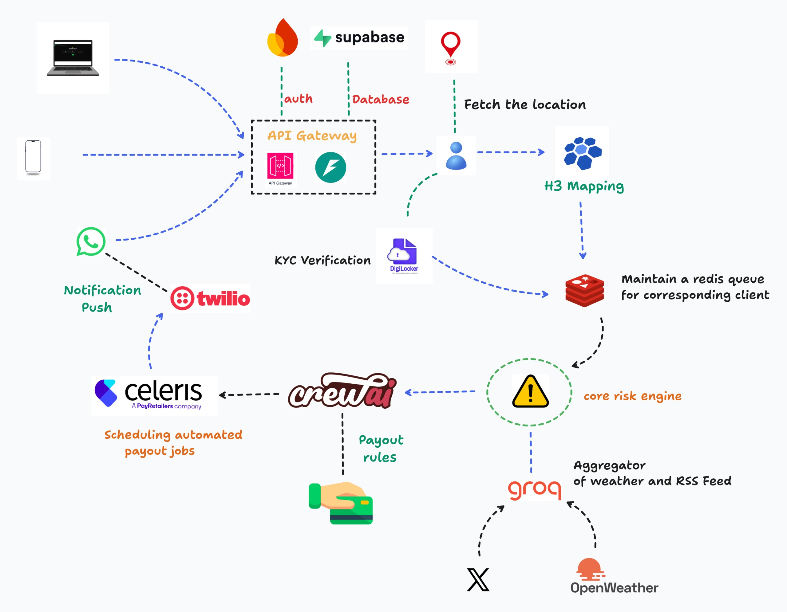
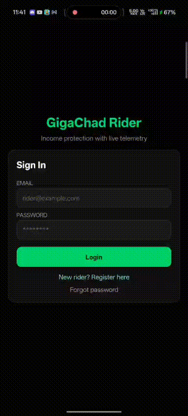
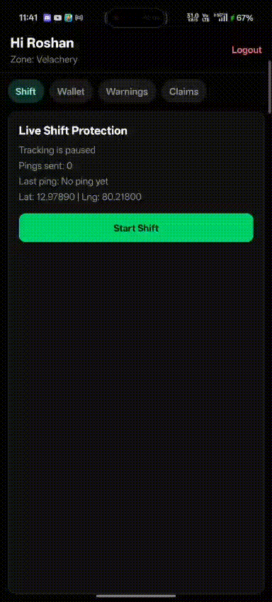
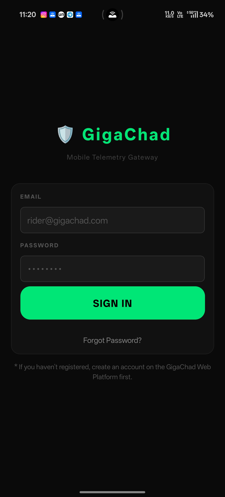
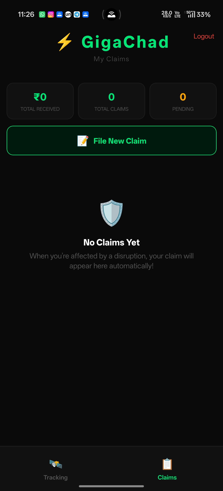
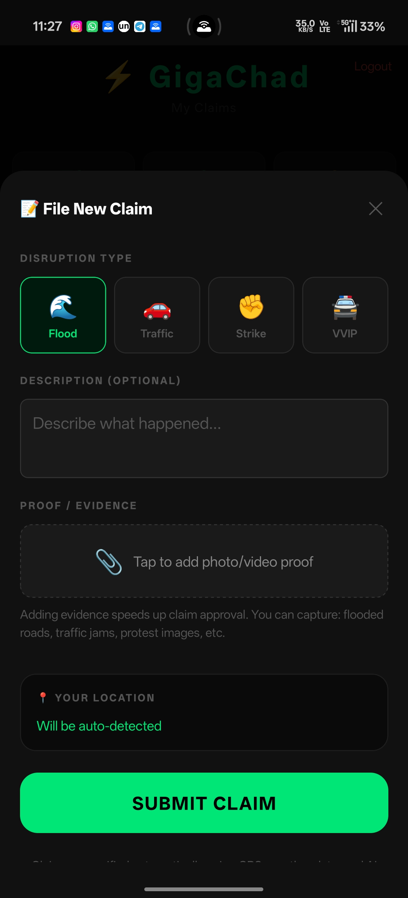

<div align="center">
  <table>
    <tr>
      <td align="center">
        
      </td>
      <td align="center">
        <h1>GigaChad</h1>
        <h3><i>The AI-Powered Q-Commerce Shield</i></h3>
        <p><b>"Protecting Chennai’s delivery partners from the storms they cannot control."</b></p>
        <p><b>Parametric income protection for gig workers. No forms. No waiting. Just chad energy.</b></p>
        <p><b>Offline Voice Support: when mobile data fails, riders can call our hotline and a LiveKit + Exotel voice agent can verify incidents, answer FAQs, and trigger claims.</b></p>
        <p><b>Kafka Telemetry Scheduler: real-time rider signals are streamed, prioritized, and orchestrated through Kafka topics for fast, resilient claim execution.</b></p>
      </td>
    </tr>
  </table>

  <br>

  
  
  
  

  <hr>
</div>

## > 🇮‌🇳‌🇸‌🇵‌🇮‌🇷‌🇦‌🇹‌🇮‌🇴‌🇳‌

Chennai is a fast-paced metropolis driven by a massive Q-Commerce economy (Zepto, Blinkit, Swiggy Instamart). Delivery partners working the busy corridors of OMR, Velachery, or T. Nagar operate in high-pressure 10-minute delivery windows. When sudden disruptions hit—like severe waterlogging during the Northeast Monsoon, unannounced political rallies causing VVIP gridlock, or local strikes—their earnings are instantly paralyzed. 

**Currently, insurance only covers accidents or vehicle damage**. There is absolutely zero safety net for **lost wages**. We built **GigaChad** to sit quietly in the background and automatically step in when Chennai turns against the worker, requiring zero claim forms and zero friction.

And when connectivity collapses during storms or civic shutdowns, workers are not stranded: they can dial a phone number and talk to our multilingual voice agent to start the same protected flow.

---

## > 🇹‌🇭‌🇪‌ 🇵‌🇷‌🇴‌🇧‌🇱‌🇪‌🇲‌: 🇹‌🇭‌🇪‌ "🇻‌🇺‌🇱‌🇳‌🇪‌🇷‌🇦‌🇧‌🇮‌🇱‌🇮‌🇹‌🇾‌ 🇬‌🇦‌🇵‌" 🇮‌🇳‌ 🇨‌🇭‌🇪‌🇳‌🇳‌🇦‌🇮‌'🇸‌ 🇬‌🇮‌🇬‌ 🇪‌🇨‌🇴‌🇳‌🇴‌🇲‌🇾‌

Chennai’s Quick-Commerce (Q-Commerce) delivery partners are the heartbeat of the city’s digital economy, yet they operate without a financial safety net against external disruptions.

1. **Hyper-Local Fragility** : Q-Commerce operates on a 10-minute delivery promise within 2-3 km radii. Unlike long-distance logistics, these "micro-zones" are highly sensitive. A localized flood in Velachery or a political rally on OMR doesn't just slow down a driver—it completely halts their ability to function.

2. **The Income-Bonus Trap** : 
   Gig worker earnings are heavily gamified. A significant portion of their daily take-home pay comes from "Daily Target Bonuses" (e.g., Complete 20 orders for an extra ₹400). When an external event strikes during peak hours, a worker doesn't just lose 2 hours of wages; they lose the entire bonus they worked 10 hours to achieve.

3. **Insurance Misalignment** : 
   Existing insurance products of **Zepto** for gig workers focus on vehicle repair, health, or accidents. There is zero protection for "Lost Opportunity Cost." When the city shuts down due to a cyclone, a strike, or a VVIP traffic block, the worker loses 100% of their potential income for that period, with no way to recover it.

4. **Connectivity Lockout** :
  During heavy rain, signal blackspots, or temporary internet shutdowns, workers may not be able to open apps at all. A truly resilient protection system must include a plain phone-call fallback that still verifies and processes claims.

5. **Barrier** : It’s regrettable that Zomato, Swiggy, Zepto, Uber etc will now have to deduct 5% of commissions paid to delivery/driver folks and pay that to the state Govt as insurance premium. This is a great step forward for the gig economy, but it also means that the insurance product must be robust, frictionless, and truly aligned with the unique risks these workers face. GigaChad is designed to fill this critical gap, providing a much-needed financial shield for Chennai’s gig workforce. [REFER](https://www.linkedin.com/posts/jshilanjanm_its-regrettable-that-zomato-swiggy-zepto-activity-7313777872043708418-o-hu/)

--- 

## > 🇹‌🇭‌🇪‌ 🇸‌🇴‌🇱‌🇺‌🇹‌🇮‌🇴‌🇳‌: 🇬‌🇮‌🇬‌🇦‌🇨‌🇭‌🇦‌🇩‌
- GigaChad is a zero-touch, AI-powered parametric micro-insurance platform built specifically to protect Chennai’s Quick-Commerce Zepto delivery partners from immediate income loss caused by localized external disruptions. Recognizing that gig workers operate on tight weekly cash flows and suffer from "app fatigue," the platform uses a tri-channel interface: a lightweight background telemetry app for secure data logging, a multilingual WhatsApp Bot for everyday interactions, and an offline voice hotline for no-internet moments.

- Unlike traditional insurance that relies on reactive, manual claims, GigaChad is entirely proactive and automated. Every Sunday, our Time-Series AI engine analyzes the upcoming week’s hyper-local forecast (weather, traffic, and civic events) to offer a fair, dynamic weekly premium via UPI. If a disruption occurs—such as severe waterlogging in Velachery or a sudden VVIP traffic gridlock—the system’s Double-Trigger logic cross-references external APIs (OpenWeather, TomTom) with rider telemetry scheduled through Kafka streams. If the worker cannot access data services, they can call the voice agent through Exotel, which orchestrates verification and claim initiation via LiveKit in the same backend flow. Once the disruption is validated, the smart contract automatically calculates the wages lost during the idle hours and instantly credits the rider's bank account, requiring zero claim forms or manual intervention.

- A Kafka-based telemetry scheduling backbone powers ingestion and orchestration across channels: mobile telemetry, trigger evaluation, fraud checks, voice-agent intents, and payout queue dispatch. This keeps claim decisions low-latency, auditable, and horizontally scalable during city-wide disruption spikes.

- To protect the insurer’s capital from the massive risk of GPS spoofing, GigaChad deploys an enterprise-grade fraud architecture. It moves beyond simple location checks by triangulating device sensor anomalies, network state (like suspicious home WiFi connections), and behavioral physics. Furthermore, it leverages a Neo4j Spatio-Temporal Graph Neural Network to detect coordinated syndicate attacks in real-time. If 50 riders suddenly spoof their coordinates to a flooded hex-grid simultaneously, the Graph AI flags the anomaly and halts payouts, ensuring that GigaChad remains a financially viable, highly scalable safety net that only pays genuine workers in distress.

---

# Architectural Diagram 


---

# > 🇵‌🇪‌🇷‌🇸‌🇴‌🇳‌🇦‌ 🇩‌🇪‌🇪‌🇵‌ 🇩‌🇮‌🇻‌🇪‌: 🇹‌🇭‌🇪‌ 🇶‌-🇨‌🇴‌🇲‌🇲‌🇪‌🇷‌🇨‌🇪‌ 🇩‌🇪‌🇱‌🇮‌🇻‌🇪‌🇷‌🇾‌ 🇵‌🇦‌🇷‌🇹‌🇳‌🇪‌🇷‌

To build a product that actually works in the real world, we cannot design for a generic "gig worker." We must design for a highly specific reality. 

Meet **Hari**, our target persona. He is a 24-year-old Quick-Commerce Zepto delivery partner operating in the Velachery / OMR micro-market in Chennai.

---

## 1. Demographic & Financial Profile

| Attribute | Reality for Hari |
| :--- | :--- |
| **Primary Platforms** | Zepto |
| **Operational Radius** | Hyper-local: 2 to 3 km around a specific "Dark Store" |
| **Delivery SLA** | 10 to 15 minutes per order |
| **Average Earnings** | ₹800 - ₹1,200 per day (Depends heavily on completing targets) |
| **Cash Flow Cycle** | Operates strictly week-to-week. Zero buffer savings. |
| **Primary Device** | Budget Android smartphone (heavy battery & thermal constraints) |
| **Language** | Tamil / Tanglish (English UI is tolerated, but native is preferred) |

### The "Milestone" Income Trap
Hari’s income is heavily gamified. He doesn't just earn a flat rate per hour. 
* **Base Pay:** ₹25 per delivery.
* **The Real Money (Incentives):** If he completes 15 deliveries between 7 PM and 11 PM, he gets a ₹300 bonus. 
* **The Vulnerability:** If severe waterlogging hits at 9 PM and traps him for 2 hours, he doesn't just lose 2 hours of base pay—**he loses the ₹300 bonus he worked all evening to unlock.** 

---

## 2. Vulnerability Mapping: How Disruptions Destroy Earnings

Hari is exposed to uniquely Indian, hyper-local disruptions that traditional insurance ignores. Because his delivery window is just 10 minutes, even minor civic failures are catastrophic.

1. **The Northeast Monsoon (Environmental):** Rain doesn't stop Hari; *waterlogged roads* do. When Velachery floods, his 2km route becomes impassable. The platform algorithms often pause the store, instantly cutting off his order flow.
2. **VVIP Movement & Rallies (Infrastructure):** Chennai traffic police frequently barricade arterial roads (like OMR or Mount Road) for political convoys. Hari is physically ready to work, but trapped in a 1-hour gridlock, destroying his hourly delivery targets.
3. **Local Bandhs & Strikes (Social):** Auto-rickshaw union strikes or local protests force shops and dark stores to pull their shutters down for safety. Hari loses an entire day of wages through no fault of his own.
4. **Digital Blackouts (Technological):** When the Zepto AWS server crashes globally, or local authorities suspend 4G internet to control a protest, Hari is digitally paralyzed on the side of the road.
5. **unsual petrol price hike (Economic):** A sudden spike in fuel prices can make it economically unviable for Hari to continue working, especially if his earnings are already thin. This is an external economic factor that can lead to a loss of income.

---

##  3. Psychological Fatigue.

We designed **GigaChad** to bypass the three major psychological barriers Hari has toward traditional InsurTech apps:

### 1: The "Tax" Perception
* **The Problem:** Hari views insurance as a scam where he pays money but claims are always denied due to "hidden terms." 
* **The GigaChad Solution:** **Dynamic Weekly Micro-Premiums.** Hari isn't locked into a ₹500/month policy. Every Sunday, he gets a transparent WhatsApp message: *"Clear weather this week. Your premium is only ₹15."* He only pays for the exact risk of that specific week, building immense trust.

### 2: App & Battery Fatigue
* **The Problem:** Hari is already running Zepto, Google Maps, and Spotify simultaneously. His budget Android phone overheats, and battery life is his lifeline. He will delete any new app that drains his battery or requires constant foreground attention.
* **The GigaChad Solution:** **The Multi-Channel Interface.** We don't force him to use a heavy insurance portal. A hyper-optimized background app quietly logs telemetry (Location/Sensors). Day-to-day interaction happens on **WhatsApp**, and when data drops, he can continue through the voice hotline.

### 3: The Claim Nightmare
* **The Problem:** Traditional claims require Hari to take photos, fill out English web forms, call customer care, and wait 7 days for an "adjuster" to approve it. He doesn't have the time or the language fluency for this.
* **The GigaChad Solution:** **Zero-Touch Parametric Automation.** Hari does nothing. Our backend AI detects the Velachery flood, validates his background telemetry, and instantly fires a UPI payout to his bank account(after clear analysis of his situation and fraud detection).

---

## 4. Why Q-Commerce(we chose) is the Perfect Tested

We specifically chose the Quick-Commerce persona for this hackathon because:
1. **Predictable Geographies:** Unlike ride-hailing drivers (Uber/Ola) who roam the whole city, Q-Commerce riders are anchored to specific hex-grids. This makes Graph-based Fraud Detection (Neo4j) and localized weather triggers highly accurate.
2. **Higher Disruption Sensitivity:** A 15-minute traffic jam is an annoyance for an Uber driver; for a Zepto rider with a 10-minute SLA, it is an absolute failure state. They need this micro-protection more than anyone else in the gig economy.

---

*This persona analysis drives every architectural decision in the GigaChad platform, ensuring our AI serves the worker, not just the insurer.*

## > 🇹‌🇭‌🇪‌ 🇮‌🇳‌🇹‌🇪‌🇷‌🇫‌🇦‌🇨‌🇪‌ 🇸‌🇹‌🇷‌🇦‌🇹‌🇪‌🇬‌🇾‌: 🇧‌🇦‌🇨‌🇰‌🇬‌🇷‌🇴‌🇺‌🇳‌🇩‌ 🇦‌🇵‌🇵‌ + 🇼‌🇭‌🇦‌🇹‌🇸‌🇦‌🇵‌🇵‌ + 🇻‌🇴‌🇮‌🇨‌🇪‌ 🇭‌🇴‌🇹‌🇱‌🇮‌🇳‌🇪‌
To balance robust data tracking with gig-worker "app fatigue," GigaChad uses a tri-channel approach:
1. **Lightweight Telemetry App (Background):** A minimal, battery-optimized app the rider installs once. It runs quietly in the background, logging GPS, accelerometer data, and network state to validate their presence in a disruption zone.
2. **WhatsApp Bot (Frontend UX):** Workers don't need to open our app to interact with us. Premium offers, policy renewals, weather warnings, and instant payout notifications are all delivered conversationally via WhatsApp, where they already spend their time.
3. **Voice Agent Hotline (Offline Fallback):** If a rider loses data connectivity, they can call a dedicated number. Exotel handles telephony ingress, LiveKit orchestrates the voice agent, and the same claim/risk engine continues the workflow without requiring app access.

---

## > 🇦‌🇵‌🇵‌🇱‌🇮‌🇨‌🇦‌🇹‌🇮‌🇴‌🇳‌ 🇼‌🇴‌🇷‌🇰‌🇫‌🇱‌🇴‌🇼‌

1. **Sunday Setup (Opt-In):** The rider receives a WhatsApp message with their dynamic weekly premium quote for the upcoming week. They accept and pay via a 1-click UPI link.
2. **Shift Tracking:** The rider starts their Zepto shift. The GigaChad background app begins logging telemetry data (location, movement, connectivity) securely.
3. **Kafka Telemetry Scheduling:** Shift events stream into Kafka topics (`telemetry.raw`, `trigger.eval`, `fraud.score`, `claim.queue`) where consumers prioritize and schedule event processing for deterministic claim orchestration.
4. **Disruption Detected:** A sudden cloudburst hits Velachery. Our backend APIs trigger a "Severe Disruption" flag for that specific hex-grid.
5. **Zero-Touch Auto-Claim:** Our backend verifies the rider's telemetry, confirming they are trapped in Velachery. The system calculates the estimated lost income for the idle hours.
6. **Instant Payout:** The smart contract automatically executes, and the rider receives a WhatsApp/SMS/voice confirmation: *"₹250 credited to your UPI for 2 hours of lost wages due to Velachery waterlogging."*
7. **Offline Call Path (When Internet Fails):** If the rider cannot access WhatsApp or the app, they call the hotline, state their location/situation in Tamil or Tanglish, and the LiveKit voice agent performs guided verification, FAQs, and claim initiation through the same backend orchestration.

---

## > 🇦‌🇧‌🇴‌🇺‌🇹‌ 🇹‌🇭‌🇪‌ 🇦‌🇵‌🇵‌

### 🎥 Prototype Preview Videos
<div align="center">

| | | | |
|:---:|:---:|:---:|:---:|
|  |  |  |  |

</div>

### 📱 App Screenshots
<table>
  <tr>
    <td></td>
    <td></td>
    <td></td>
  </tr>
</table>

### ☎️ Offline Voice Claim Support (LiveKit + Exotel)
- Riders can directly call a mobile number during signal/data outages.
- Exotel receives and routes the call to the LiveKit agent runtime.
- The voice agent captures incident details (location, disruption type, idle time), performs policy and telemetry checks, and opens/verifies claims.
- The same channel also works as a multilingual Q/A copilot for policy, premium, and payout status.

### 📡 Kafka Telemetry Scheduling Engine
- Rider telemetry, weather feeds, traffic deltas, and voice-agent intents are published into partitioned Kafka topics.
- Stream consumers execute trigger scoring, fraud enrichment, and payout eligibility in near real-time.
- Priority-aware scheduling ensures severe-disruption events are processed first during peak load windows.
- Replay-safe offsets and topic retention provide auditability for every claim decision path.

🇹‌🇷‌🇮‌-🇮‌🇳‌🇹‌🇪‌🇷‌🇫‌🇦‌🇨‌🇪‌ 🇦‌🇷‌🇨‌🇭‌🇮‌🇹‌🇪‌🇨‌🇹‌🇺‌🇷‌🇪‌
Gig workers already run heavy, battery-draining navigation and delivery apps on budget smartphones. Forcing them to install another heavy insurance portal leads to instant uninstalls. GigaChad solves "App Fatigue" by splitting the architecture into three complementary layers:


1. **The Telemetry Engine (Invisible Background App):** A hyper-optimized, lightweight React Native app installed once. It operates silently in the background during active shifts, securely logging essential telemetry (GPS hex-grid location, accelerometer data, network state). It has almost zero UI and is designed to consume minimal battery, ensuring it doesn't interfere with the rider's primary apps or device performance. This data is crucial for validating claims and detecting fraud without any user interaction.
  
2. **The Worker Frontend (WhatsApp Bot):** All actual user interaction happens on WhatsApp, an app the rider already trusts and keeps open. Through a Twilio/Meta API integration, the bot operates in local languages (Tamil/Tanglish). It handles Sunday premium quotes, UPI payment links, storm warnings, and instant payout receipts.

3. **The Voice Safety Net (Phone Call Agent):** When mobile internet is unavailable, the rider can call an Exotel number. LiveKit runs the conversational agent that asks structured claim questions, answers common doubts, validates identity/policy context, and synchronizes everything with the same backend claim engine.

---

## > 🇭‌🇴‌🇼‌ 🇹‌🇭‌🇪‌ 🇹‌🇷‌🇮‌🇬‌🇬‌🇪‌🇷‌🇸‌ 🇼‌🇴‌🇷‌🇰‌: 🇹‌🇭‌🇪‌ "🇩‌🇴‌🇺‌🇧‌🇱‌🇪‌-🇹‌🇷‌🇮‌🇬‌🇬‌🇪‌🇷‌" 🇱‌🇴‌🇬‌🇮‌🇨‌
Standard parametric insurance fails in gig work because it uses basic logic: *If it rains, pay the worker.* But rain doesn't stop deliveries; **waterlogging and gridlock do.** GigaChad uses a composite index to ensure payouts are only triggered during genuine civic halts.


1. **Hex-Grid Mapping (Uber H3):** Chennai is divided into localized hexagonal nodes. Triggers only fire for the specific grid the rider is currently occupying, not the whole city.
2. **The Double-Trigger System (Environmental):** Our smart contracts require two conditions to be met simultaneously:
   * *Trigger A (Cause):* OpenWeather API detects > 30mm of rain in Velachery.
   * *Trigger B (Effect):* TomTom Traffic API confirms average vehicle velocity in that grid has collapsed below 5 km/h.
3. **NLP-Driven Social Triggers:** For strikes and curfews, a lightweight LLM (Llama-3) continuously scrapes local X (Twitter) feeds and Tamil news APIs. If it detects a 90% confidence spike in terms like *"OMR barricade"* or *"Velachery strike,"* it flags a "Social Disruption" event.
4. **Automated Execution Across Channels:** Once a grid is flagged as "Disrupted," the backend checks the Telemetry App. If Hari is verified to be active inside that hex-grid, the payout layer calculates his lost hours and triggers an instant Razorpay/UPI transfer. If Hari reaches us via phone call, voice transcripts and intent slots from the LiveKit agent are attached to the same claim case for auditable processing.
5. **Kafka-Orchestrated Scheduling:** Trigger and telemetry events are sequenced through Kafka consumers, enabling deterministic ordering, backpressure handling, and reliable claim handoff from detection to payout.


--- 

## > 🇹‌🇭‌🇪‌ 🇵‌🇷‌🇪‌🇲‌🇮‌🇺‌🇲‌ 🇲‌🇴‌🇩‌🇪‌🇱‌: 🇦‌🇮‌-🇩‌🇷‌🇮‌🇻‌🇪‌🇳‌ 🇹‌🇮‌🇪‌🇷‌🇪‌🇩‌ 🇵‌🇷‌🇮‌🇨‌🇮‌🇳‌🇬‌

Gig workers manage their cash flows strictly week-to-week, earning an average of ₹800–₹1,200 per day. A flat, expensive monthly premium will result in zero adoption. 

GigaChad utilizes a **Dynamic Weekly Pricing Model**. Every Sunday night, our AI Actuarial Engine predicts the disruption risk for the upcoming week in Chennai (e.g., weather forecasts, scheduled strikes). Based on the AI's risk score, the worker is offered three coverage tiers via WhatsApp.

GigaChad utilizes a **Dynamic Weekly Pricing Model**, powered by pre-trained Time-Series Foundation Models (Amazon Chronos / TimeGPT):
* **The Actuarial Prediction:** Every Sunday night, our AI analyzes the upcoming 7-day forecast for the rider's specific Chennai micro-zone (e.g., IMD cyclonic warnings, scheduled political rallies, historical traffic velocity).
* **Dynamic Quotes:** If the upcoming week is clear, the bot offers a micro-premium of just **₹15**. If heavy monsoons are predicted, the premium intelligently scales up to **₹45**. 
* **The Worker Benefit:** They never overpay during safe weeks. 
* **The Insurer Benefit:** Premium pricing perfectly hedges against the calculated statistical risk of the week.

> **Note on Dynamic Pricing:** *The premiums below represent a "Standard Risk" week. If the AI predicts a completely dry, disruption-free week, these prices dynamically drop by 40%. If a cyclone is predicted, the AI raises the premium to protect the insurer's liquidity pool.*

| Tier | Weekly Premium | Coverage / Payout Cap | Target User |
| :--- | :--- | :--- | :--- |
| **🥉 Giga Basic** | **₹19** / week | **₹300 per event** *(Covers ~3 hours of lost base wages)* | Part-time riders who only work peak evening shifts (7 PM - 11 PM). |
| **🥈 Giga Plus** | **₹39** / week | **₹600 per event** *(Covers half-day of lost wages + minor missed incentives)* | Standard full-time riders operating 8-10 hour shifts. |
| **🥇 Giga Pro** | **₹59** / week | **₹1,000 per event** *(Covers full-day income loss + daily milestone bonuses)* | Power-riders working 14-hour shifts who rely heavily on daily completion bonuses. |

---

### 💸 🇭‌🇴‌🇼‌ 🇹‌🇭‌🇪‌ 🇵‌🇦‌🇾‌🇴‌🇺‌🇹‌ 🇲‌🇦‌🇹‌🇭‌ 🇼‌🇴‌🇷‌🇰‌🇸‌ (🇪‌🇽‌🇦‌🇲‌🇵‌🇱‌🇪‌: Giga 🇵‌🇱‌🇺‌🇸‌)
Our system strictly ensures payouts correlate with **actual lost working hours**, adhering to the hackathon's "Loss of Income Only" constraint. 

1. **The Baseline:** Hari is subscribed to the **Shield Plus** tier. Our system's historical data shows he averages ₹100/hour during evening shifts.
2. **The Event:** A sudden cloudburst hits Velachery. The system's Double-Trigger `(Rain > 30mm AND Traffic < 5km/h)` fires. Hari's telemetry shows he is physically trapped in the hex-grid for 3 hours.
3. **The Calculation:** 3 Hours of Idle Time × ₹100/hr = **₹300 Expected Income Loss**.
4. **The Payout:** The smart contract instantly credits **₹300** to Hari's UPI account. Since ₹300 is well within his tier's ₹600 payout cap, the claim is fully covered with zero manual intervention.
---

## 🧠 🇦‌🇮‌/🇲‌🇱‌ 🇮‌🇳‌🇹‌🇪‌🇬‌🇷‌🇦‌🇹‌🇮‌🇴‌🇳‌ 🇦‌🇷‌🇨‌🇭‌🇮‌🇹‌🇪‌🇨‌🇹‌🇺‌🇷‌🇪‌
Instead of relying on legacy ML, we build GigaChad using state-of-the-art **Pre-Trained Foundation Models** to handle risk, NLP, and graph anomalies with zero-shot capabilities:

1. **Actuarial Risk & Premium Engine (Time-Series Foundation Models):** 
   * **Model:** **Amazon Chronos (T5-based)** / **TimeGPT (Nixtla)**
   * **Implementation:** Instead of training a model from scratch, we use pre-trained universal time-series models. We feed them Chennai's historical traffic velocity and weather patterns. They perform zero-shot probabilistic forecasting to predict the exact likelihood of "lost gig hours" for the upcoming week, automatically setting our ₹15–₹45 dynamic premium.
2. **Hyper-Local Environmental Triggers:**
   * **Model:** **Microsoft ClimaX** (Pre-trained Foundation Model for Weather/Climate)
   * **Implementation:** Standard APIs just tell you it's raining. By leveraging ClimaX, we predict *impact*. We cross-reference rainfall predictions with Chennai's topological map to accurately trigger payouts for "Waterlogging," not just harmless drizzle.
3. **Social Disruption Detection (Event Extraction):**
   * **Model:** **Llama-3 (8B) / Mistral (via API)** 
   * **Implementation:** We run real-time sentiment and entity extraction on localized X (Twitter) feeds and Tamil news streams. The LLM acts as an orchestrator, looking for terms like *"OMR barricade,"* *"T. Nagar strike,"* or *"bus burning."* When confidence exceeds 90%, it triggers a "Civic Halt" payout.
4. **Intelligent Fraud Detection (Graph Neural Networks):**
   * **Model:** **GraphSAGE** on a **Neo4j Spatio-Temporal Graph**
   * **Implementation:** GPS spoofing rings are organized. We use pre-trained Graph embeddings to map Rider Nodes to Hex-Grid Nodes. If GraphSAGE detects an anomalous cluster (e.g., 50 riders suddenly "teleporting" to a flooded zone from different IP addresses within 30 seconds), it automatically freezes the payouts.
5. **Voice Claim Orchestration (Conversational AI):**
  * **Runtime:** **LiveKit Agents + Exotel Telephony**
  * **Implementation:** The voice agent handles multilingual phone conversations, extracts structured claim entities (location, time window, disruption context), answers policy FAQs, and pushes validated call context into the same claim orchestration service.
6. **Telemetry Stream Scheduling (Event Backbone):**
  * **Runtime:** **Apache Kafka + Consumer Workers**
  * **Implementation:** Event streams coordinate telemetry intake, disruption detection, fraud scoring, and payout jobs with ordered topic processing and retry-safe consumer groups.

---


## > 🇪‌🇩‌🇬‌🇪‌ 🇨‌🇦‌🇸‌🇪‌🇸‌ 🇭‌🇦‌🇳‌🇩‌🇱‌🇪‌🇩‌ (🇪‌🇳‌🇹‌🇪‌🇷‌🇵‌🇷‌🇮‌🇸‌🇪‌-🇬‌🇷‌🇦‌🇩‌🇪‌ 🇷‌🇴‌🇧‌🇺‌🇸‌🇹‌🇳‌🇪‌🇸‌🇸‌)
A fully automated payout system is a massive target for fraud. We built GigaChad to proactively handle complex edge cases and adversarial attacks:

* **Edge Case 1: The "Home Couch" Claim (Location Spoofing)**
  * *Scenario:* A rider sits at home, uses a GPS-spoofing app to fake their location into a flooded zone, and waits for a payout.
  * *Handling:* GigaChad triangulates network data. If the app detects the rider is connected to their **Home WiFi SSID**, or if their accelerometer shows the phone is perfectly stationary on a table during a "severe storm," the claim is instantly denied. 

* **Edge Case 2: Coordinated Syndicate Attacks**
  * *Scenario:* A Telegram group coordinates 100 riders to simultaneously spoof their GPS to a single disrupted grid to drain the liquidity pool.
  * *Handling:* We map all active claims onto a **Neo4j Spatio-Temporal Graph**. If the GraphSAGE model detects a massive cluster of riders "teleporting" into a hex-grid within a 2-minute window without any natural geographical path (velocity plausibility), it flags the syndicate and freezes payouts.

* **Edge Case 3: The "Milestone Target" Loss**
  * *Scenario:* A rider is trapped by a VVIP gridlock for 2 hours. They don't just lose 2 hours of base pay; they miss their daily 15-delivery target, losing a ₹300 bonus.
  * *Handling:* The AI calculates the rider's historical run-rate. If they were statistically on track to hit their milestone before the disruption, the payout dynamically scales to cover a percentage of the lost incentive, not just the base hourly wage.

* **Edge Case 4: False Positives in Genuine Storms**
  * *Scenario:* A genuine rider is caught in a storm, but extreme weather causes their GPS to drift and network to drop, causing our AI to wrongfully flag them as "suspicious."
  * *Handling:* We don't binary-reject. We issue a "Soft Flag." The worker gets a WhatsApp message asking for verification. The rider simply replies with a **10-second live video** of the flooded street. A human reviewer approves it instantly. Fraudsters at home cannot fake a live video of a flood.

* **Edge Case 5: Full Data Blackout During Claim Window**
  * *Scenario:* The rider cannot access mobile internet and cannot reach WhatsApp/app flows while trapped in disruption.
  * *Handling:* The rider places a normal phone call to the Exotel number. The LiveKit voice agent collects claim evidence conversationally, links it to telemetry history, and keeps the payout pipeline active even without data services.

--- 

## 🚨 🇪‌🇳‌🇹‌🇪‌🇷‌🇵‌🇷‌🇮‌🇸‌🇪‌-🇬‌🇷‌🇦‌🇩‌🇪‌ 🇫‌🇷‌🇦‌🇺‌🇩‌ 🇩‌🇪‌🇹‌🇪‌🇨‌🇹‌🇮‌🇴‌🇳‌
A fully automated parametric system is highly vulnerable to GPS spoofing. If we just rely on location, a worker sitting at home can spoof their GPS to a flooded zone and collect free money. GigaChad uses multi-layered anomaly detection:


* **Sensor Fusion Mismatch:** If the GPS claims the rider is in a storm, but the accelerometer shows the phone resting flat on a table and the barometer shows indoor pressure, the AI flags the claim.
* **Network Triangulation:** If a rider claims to be trapped in a flooded street but the background app detects they are connected to their **Home WiFi**, the claim is instantly denied.
* **Syndicate / Ring Detection (Neo4j):** Handled by our GraphSAGE models to prevent coordinated liquidity drains.
* **The Escape Valve:** If flagged, a genuine rider can instantly appeal by sending a 10-second live video of the flooded street via WhatsApp.

---

## ✨ 🇸‌🇵‌🇪‌🇨‌🇮‌🇦‌🇱‌ 🇫‌🇪‌🇦‌🇹‌🇺‌🇷‌🇪‌🇸 
* **The Double-Trigger System:** Rain alone doesn't stop deliveries; waterlogging does. Our system requires a Double-Trigger: `(Rain > 30mm)` **AND** `(Traffic Speed < 5 km/h)`. This protects the insurer from paying out for harmless weather.
* **Digital Blackout Coverage:** India frequently experiences localized internet shutdowns or gig platform server crashes. GigaChad monitors Cloudflare Radar and Downdetector; if a rider is willing to work but the digital infrastructure fails, they get paid.
* **Offline Voice-First Claims:** Riders can call a plain phone number when internet is down. Exotel + LiveKit voice orchestration performs multilingual claim intake, policy Q/A, and backend handoff without app access.
* **Kafka-Scheduled Telemetry Pipeline:** Topic-based scheduling orchestrates high-volume event flow from rider telemetry to claim settlement with low latency and strong reliability.
* **Predictive Earnings Copilot:** Before a storm hits, the WhatsApp bot proactively messages the rider: *"Warning: Heavy rain predicted in T. Nagar in 30 mins. Move to Alwarpet to maintain your earnings stream. If you stay, your income protection is active."*

---
## Complete Tech Stack

| Layer | Tools Used | Purpose |
| :--- | :--- | :--- |
| Web Dashboard | Next.js, React, Tailwind CSS | Admin/Rider UI, demo flow, pricing/claims views |
| Mobile App | React Native, Expo | Rider tracking, claims, proof submission |
| Auth | Firebase Authentication | Login, session handling (real + mock login) |
| Maps & Location | OpenStreetMap, Leaflet | Live rider location and risk-zone map |
| Backend APIs | Python (FastAPI), Node.js | Triggers, claim workflow, automation |
| Database | PostgreSQL | User, rider, policy, claim data |
| Stream Orchestration | Apache Kafka | Telemetry scheduling, trigger pipeline, claim queue orchestration |
| AI / Risk Engine | TimeGPT / Chronos, Llama-3 | Premium prediction, assistant/NLP flows |
| Voice Agent & Telephony | LiveKit Agents, Exotel | Offline hotline claim intake, multilingual voice Q/A, call-to-claim orchestration |
| Fraud Detection | Neo4j, PyTorch Geometric (GraphSAGE) | Spoof/ring fraud detection |
| Messaging | WhatsApp Business API (Twilio / Meta) | Onboarding, alerts, payout notifications |
| External Integrations | OpenWeather, TomTom Traffic, Razorpay | Disruption signals and payouts |
| DevOps | Docker, AWS, GitHub Actions | Containerization, deployment, CI/CD |

---

## > ⚙️ 🇸‌🇪‌🇹‌🇺‌🇵‌

To run GigaChad locally, you can use either:
1. **Docker-first full stack launch** (recommended)
2. **Manual service-by-service launch**

---

### Prerequisites

- Python 3.11+
- Node.js 18+ and npm
- Docker + Docker Compose
- Expo tooling (for mobile testing)
- API keys/secrets for backend integrations
- Exotel telephony credentials (SID/API key/secret)
- LiveKit URL, API key, and secret for voice agent orchestration
- Apache Kafka broker access (or Dockerized Kafka)

---

### Docker Setup (Recommended)

1. Create required env files:
  - `services/backend/.env`
  - `apps/whatsapp-bot/.env`
2. Add voice channel credentials in backend env (`EXOTEL_*`, `LIVEKIT_*`) so hotline calls can route into the claim orchestration pipeline.
3. Start everything:

```bash
docker compose up --build
```

4. Access services:
  - Dashboard: `http://localhost:3000`
  - Backend API: `http://localhost:8000`
  - WhatsApp Bot: `http://localhost:3001`
  - Neo4j Browser: `http://localhost:7474`
  - Voice Hotline: Exotel managed number mapped to your LiveKit agent webhook
  - Kafka Broker: `localhost:9092`

---

### Manual Setup

**Backend (FastAPI)**
```bash
cd services/backend
python -m venv .venv
source .venv/bin/activate
pip install -r requirements.txt
uvicorn main:app --host 0.0.0.0 --port 8000 --reload
```

**Dashboard (Next.js)**
```bash
cd dashboard
npm install
npm run dev
```

**WhatsApp Bot (Node.js)**
```bash
cd apps/whatsapp-bot
npm install
npm run dev
```

**Mobile App (Expo)**
```bash
cd apps/mobile
npm install
npm run start
```

---

## > 🇩‌🇪‌🇵‌🇱‌🇴‌🇾‌🇲‌🇪‌🇳‌🇹‌

Production deployment includes three customer channels (app telemetry, WhatsApp bot, and voice hotline) and a Kafka event backbone for stream scheduling (Exotel ingress -> LiveKit agent -> Kafka topics -> backend claim APIs). This ensures support continuity and low-latency orchestration even during internet outages.

<div align="center">

  <br>

  <a href="https://devtrails-hack-2026.vercel.app/">
    
  </a>

  <!-- <br><br> -->
  <div style="height: 10px;"></div>
  <a href="https://github.com/Git-Roshan09/Devtrails-hack-2026/releases/tag/gigachad">
    
  </a>

  <hr>

</div>


### 🔌 Services + Ports

| Service | Port | Purpose |
| :--- | :--- | :--- |
| postgres | 5432 | Policy, rider, claim data |
| redis | 6379 | Cache and async state |
| kafka | 9092 | Telemetry stream scheduling and event transport |
| neo4j | 7474 / 7687 | Graph UI and bolt |
| backend | 8000 | FastAPI APIs |
| whatsapp_bot | 3001 | Twilio webhook service |
| livekit (self-hosted optional) | 7880 / 7881 | Voice agent runtime and media signaling |
| exotel (managed) | N/A | Public phone ingress and call routing |
| dashboard | 3000 | Next.js frontend |

---

*Built for the Guidewire DEVTrails Hackathon 2026.*
# 𝔹𝕪 𝕋𝕖𝕒𝕞 ℕ𝕠𝕠𝕘𝕝𝕖𝕣𝕤
